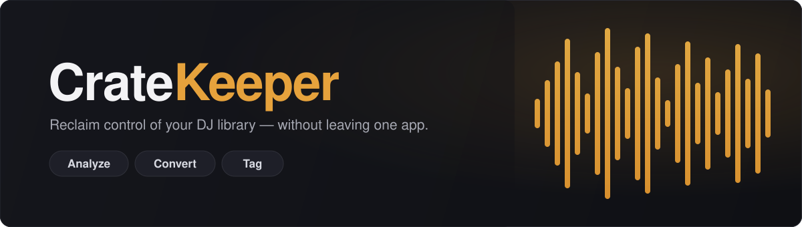
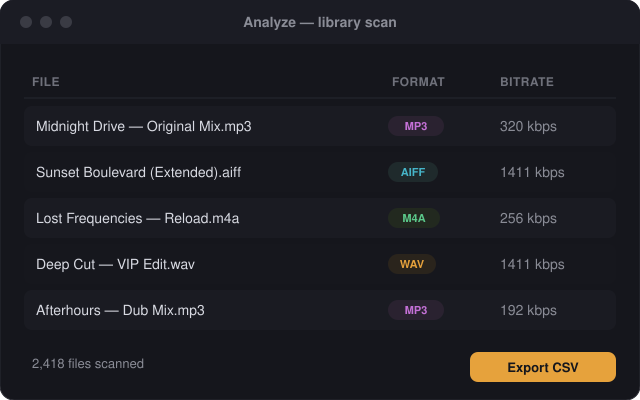
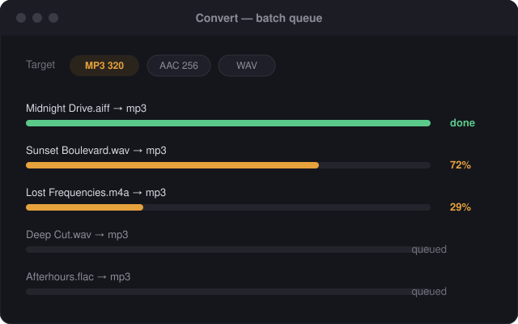
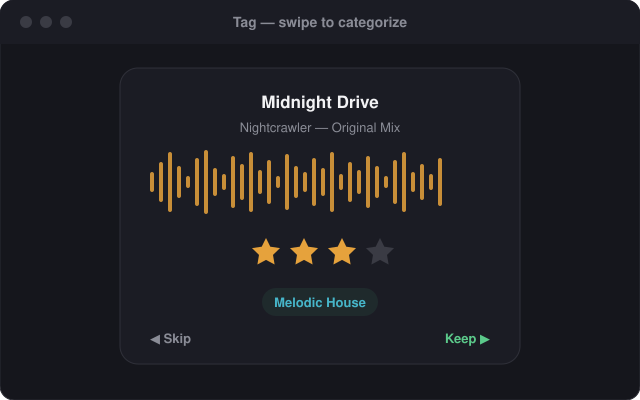

<div align="center">



<p>
  <a href="https://github.com/Theosantos/CrateKeeper/releases/latest"></a>
  
  <a href="LICENSE"></a>
  
  <a href="https://github.com/Theosantos/CrateKeeper/releases"></a>
</p>

**Take your DJ library from messy to clean — analyze, convert, and tag, all in one desktop app.**

[Download](#-download--install) · [Features](#-features) · [Updating](#-updating) · [Development](#-development)

</div>

---

CrateKeeper is a desktop app for DJs who want to reclaim control of their music library.
It bundles three tools behind one interface so you can go from "library in disarray" to
"clean, tagged collection" without juggling scripts, the command line, or a dozen utilities.

- **No setup.** FFmpeg is bundled — no Homebrew, Node, or command line required.
- **Rekordbox-ready.** Tags are written as standard ID3v2.3 / MP4 atoms that Rekordbox reads correctly.
- **Stays responsive.** Scanning and converting run on worker threads, so the UI never freezes.

## ✨ Features

### 🔍 Analyze
Batch-scan a folder of thousands of tracks and see format, bitrate, and metadata at a glance.
Spot the lossy files hiding in your "lossless" crate, and export a CSV report of the whole library.

### 🎚️ Convert
Transcode to a target format and bitrate (MP3 320 by default) with the bundled FFmpeg.
A non-blocking batch queue shows per-file progress and keeps going if one file fails.

### 🏷️ Tag
A Tinder-style swipe interface for the tedious part: categorizing untagged tracks.
Preview the waveform, set genre / rating / comment, and CrateKeeper writes
**Rekordbox-compatible** ID3v2.3 (MP3) and MP4 tags back to the files.

## 📸 Screenshots

> Placeholder mockups — see [`docs/screenshots/`](docs/screenshots/) to swap in real captures.

<table>
  <tr>
    <td width="33%"><br><sub><b>Analyze</b> — library scan + CSV export</sub></td>
    <td width="33%"><br><sub><b>Convert</b> — batch transcode queue</sub></td>
    <td width="33%"><br><sub><b>Tag</b> — swipe to categorize</sub></td>
  </tr>
</table>

## ⬇️ Download & Install

Grab the latest installer from the **[Releases page](https://github.com/Theosantos/CrateKeeper/releases)**:

| System | File |
|--------|------|
| **macOS** (Apple Silicon **or** Intel) | `CrateKeeper-1.0.0-universal.dmg` |
| **Windows** (64-bit) | `CrateKeeper-Setup-1.0.0.exe` |

> ℹ️ CrateKeeper v1 is **not code-signed yet**, so the first-launch steps below are expected.
> Only follow them for the app downloaded from the official Releases page above.

### macOS — first launch
1. Open the `.dmg` and drag **CrateKeeper** to **Applications**.
2. In Applications, **right-click** (or Control-click) **CrateKeeper** → **Open** → **Open**.
3. ⚠️ Don't launch it with a normal double-click the first time — an unsigned app shows a misleading
   *"CrateKeeper is damaged"* message that way. The right-click → Open path opens it cleanly; after
   that, it launches normally.

### Windows — first launch
1. Run `CrateKeeper-Setup-1.0.0.exe`.
2. If **Windows SmartScreen** appears, click **More info** → **Run anyway**.
3. Finish the per-user install (no admin password needed), then launch CrateKeeper.

Nothing else to install — FFmpeg ships inside the app.

## 🔄 Updating

- **Windows** auto-updates in the background via [electron-updater](https://www.electron.build/auto-update) (NSIS).
- **macOS** does a lightweight version check on launch and points you to the Releases page when a newer
  version exists. Update checks fail silently when offline — they never block the app.

## 🛠️ Built with

[Electron](https://www.electronjs.org/) · [electron-vite](https://electron-vite.org/) ·
[React](https://react.dev/) + [TypeScript](https://www.typescriptlang.org/) ·
[Zustand](https://github.com/pmndrs/zustand) · [Framer Motion](https://www.framer.com/motion/) ·
[better-sqlite3](https://github.com/WiseLibs/better-sqlite3) ·
[FFmpeg](https://ffmpeg.org/) (bundled via `ffmpeg-static`) ·
[music-metadata](https://github.com/borewit/music-metadata) · [node-id3](https://github.com/Zazama/node-id3)

## 💻 Development

Requires Node.js 22+.

```bash
npm install      # install dependencies
npm run dev      # run the app with hot reload
npm test         # run the test suite (Vitest)
npm run typecheck
```

### Building installers locally

```bash
npm run build:mac    # macOS Universal .dmg
npm run build:win    # Windows NSIS .exe (Windows host only)
```

### Releasing

Both installers are built and published by GitHub Actions
([`.github/workflows/release.yml`](.github/workflows/release.yml)):

- **Build only** (downloadable artifacts): *Actions → Release → Run workflow* (leave *publish* unchecked).
- **Build + publish** a GitHub Release: push a version tag —
  ```bash
  git tag v1.0.0 && git push origin v1.0.0
  ```

## 📄 License

[MIT](LICENSE) © Theo Santos
